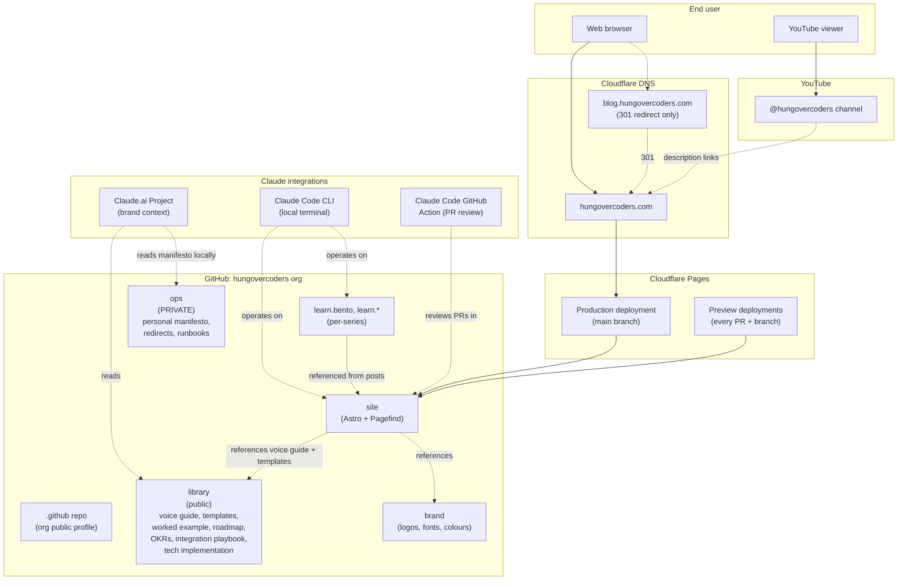
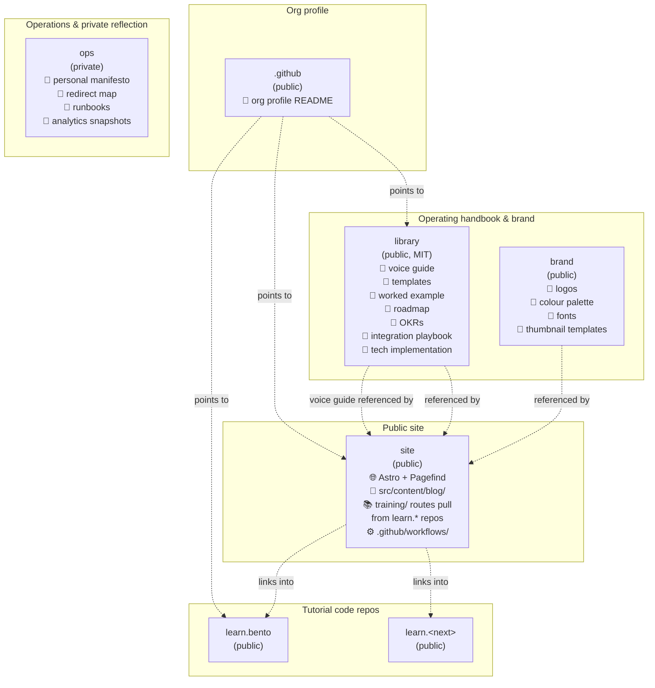
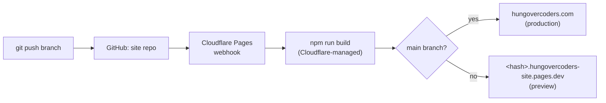
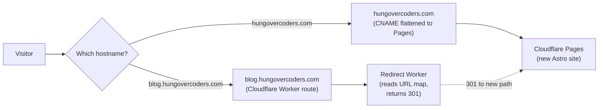
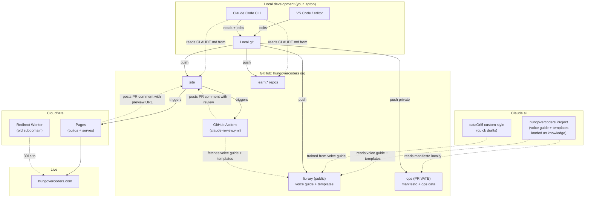

# Hungovercoders Technical Implementation

> The concrete build sheet for the relaunch. Org structure, repository hierarchy, settings, secrets, workflows, integrations, hosting, DNS, and the Claude integration plumbing — all in one place so future-you (or anyone you bring in) can stand up the whole thing without re-deriving it from the strategy docs.

This document is the *engineering spec*. The roadmap tells you the journey; this tells you the wiring. Diagrams are in Mermaid so they render natively in GitHub.

**Key choices baked in:**

- **GitHub org:** existing `hungovercoders` org. `dataGriff` remains your personal author handle.
- **Hosting:** Cloudflare Pages with native preview deploys.
- **Default visibility:** public unless there's a real reason for private. The brand is generosity-coded; build in the open.

---

## 1. The high-level system

The setup is a small, opinionated, source-controlled estate. Single GitHub org. Single hosting provider (Cloudflare Pages). Single CDN-level domain (`hungovercoders.com`). Content lives in markdown in repos, never in a CMS. Voice guide and templates live in their own repo and are referenced from every site repo's `CLAUDE.md`.



Notable features of this shape:

- **Cloudflare Pages + Cloudflare DNS means one provider runs the whole web edge.** DNS, hosting, certs, CDN, redirect rules, analytics — all in one dashboard. Fewer moving parts, fewer accounts to keep in sync.
- **Preview deploys are first-class.** Every PR gets its own `<hash>.<project>.pages.dev` URL automatically. Branch deployments work the same way. This is a meaningful workflow improvement over a single-deploy host.
- **All the brand assets, voice docs, and content live in GitHub.** Nothing depends on a SaaS CMS. If GitHub vanished tomorrow you'd `git clone` everything to GitLab in an afternoon.
- **The content repo is referenced, not embedded.** The site repo doesn't copy the voice guide; it references the content repo. When you update the voice guide, the new version is the single source of truth — no syncing required.
- **The Claude surfaces are not in the data path.** They're operational tooling. The site works without them; they make running it sustainable.

---

## 2. GitHub organisation: `hungovercoders`

You already have the org, which simplifies things — no migration. The personal handle `dataGriff` continues as the byline (about page, author frontmatter on posts, YouTube on-camera name), while `hungovercoders` is the publication. Both names appear in different places without competing.

### The org public profile page

GitHub orgs have a public profile page that renders the README of a special `.github` repo at `github.com/hungovercoders/.github/profile/README.md`. **This is the most underused free brand surface you have.** It shows up to anyone who lands on `github.com/hungovercoders` — including anyone who clicks your GitHub link from a blog post, YouTube description, or LinkedIn.

Use it as a *table of contents for the whole brand*, in voice:

```markdown
# hungovercoders

> Small. Cheap. Yours. Source-controlled. Deployable by one slightly hungover
> person on a Tuesday. The hungovercoders worldview, applied to data engineering
> and adjacent crafts. Run by [dataGriff](https://github.com/dataGriff).

## 🌐 The site

Blog, training, and the worldview itself: **[hungovercoders.com](https://hungovercoders.com)**.

## 📺 The channel

YouTube: **[@hungovercoders](https://youtube.com/@hungovercoders)**. New video
every fortnight during a training-series launch; one a month otherwise.

## 📚 The repos

### Where the brand lives
- **[library](https://github.com/hungovercoders/library)** — templates, worked examples, and the technical playbook. The publishable subset of the content system.
- **[site](https://github.com/hungovercoders/site)** — the Astro project that builds hungovercoders.com.
- **[brand](https://github.com/hungovercoders/brand)** — logos, fonts, palette, thumbnail templates.

### Where the tutorials live
- **[learn.bento](https://github.com/hungovercoders/learn.bento)** — YAML-first stream processing with Bento.
- *(more series appear as they ship)*

## 🍻 Want to work with me?

Selective consulting and contract work: [hungovercoders.com/work-with-me](https://hungovercoders.com/work-with-me).
```

Ten minutes to write, pays back forever. Update as new tutorials ship.

### Org-level settings

In `github.com/organizations/hungovercoders/settings`:

| Setting | Value | Reason |
|---|---|---|
| **Default repository permission** | `Read` | Tighter than `Write`. Members get write only where needed. |
| **Member privileges → repository creation** | `Public and private` | Need both. |
| **Member privileges → repository forking** | Enabled | Lets community fork tutorial repos. |
| **Member privileges → page creation** | `Public` | No private pages on the org. |
| **Two-factor authentication requirement** | Enabled | Required for any org with secrets. |
| **Verified domains** | Add `hungovercoders.com` | Verified domain badge on profiles. |
| **GitHub Actions → policies** | Allow `anthropics/*`, `actions/*`, `cloudflare/*`, selected actions | Lock down what actions can run. |
| **Default branch name for new repos** | `main` | Modern default. |

### Org-level secrets

A single org-level secret pays for itself across all repos:

| Secret name | Value | Used by |
|---|---|---|
| `CLAUDE_CODE_OAUTH_TOKEN` | OAuth token from the Claude Code GitHub App installation | Every repo's editorial-review workflow |

Set at org level and grant per-repo as you create them. Rotate in one place.

Cloudflare's GitHub integration doesn't need a stored secret here — it authenticates via the Cloudflare GitHub App, Cloudflare-side.

---

## 3. Repository hierarchy

Six kinds of repository, each with a distinct job.



### Public vs private — the honest take

The principle is **public by default, with one explicit carve-out for genuinely personal material**. The hungovercoders worldview is *small, cheap, yours, source-controlled* — and being demonstrably open about how the system works is more on-brand than gating it. Anyone determined enough to clone the voice could reverse-engineer most of this from a few dozen blog posts anyway; making the operating handbook explicit is a clearer brand statement than hiding it.

#### What goes public

- **`.github`** — must be public for the profile page to render. GitHub mechanic.
- **`library`** — the operating handbook. Voice guide, templates, worked example, roadmap, OKRs, technical implementation spec, Claude integration playbook. Public because the brand IS the openness. A determined reader can reverse-engineer the voice from the blog posts; making the system explicit is a clearer brand statement than hiding it. Also a recruitable artefact — useful to potential consulting clients, podcast hosts, anyone trying to understand how this thing actually works.
- **`site`** — readers can file PRs for typos, see how the site is built, fork it as a starting point. Doubles as a portfolio piece for the consulting offer.
- **`brand`** — logos and palette aren't sensitive; they're brand assets. License under CC BY 4.0 (attribution required) for explicit clarity.
- **Tutorial repos** (`learn.bento` etc.) — obviously public.

#### What stays private

Only one document is qualitatively different enough to stay private, plus the operational data:

- **The personal manifesto.** Not because it's IP — it isn't, really — but because it's *personal reflection* written explicitly for the author, not for readers. The honest content about drinking, identity, the gap between aspirations and lived reality. That stuff stays yours.
- **The redirect map** (lists every old URL — useful intel for someone planning an SEO attack), **the runbooks**, and **analytics snapshots**. Operational data — none of this helps readers, some of it could help attackers, all of it stays in `ops`.

So: **five public repos, one private.** The private repo is the only place a determined reader can't see — and what's in it is the kind of personal reflection that benefits from privacy regardless of any IP argument.

### Why this is the right call (and where the previous reasoning went wrong)

Earlier versions of this document argued first for everything public, then pulled the voice guide and roadmap into a private repo. Both positions were defensible-but-incomplete. The honest synthesis:

- **The "craft moat" argument for privatising the voice guide overstated the threat.** Privacy is a speedbump, not a moat — anyone reading the blog can reverse-engineer most of the voice with a few hours of effort. The marginal protection from privacy is small; the marginal benefit from being demonstrably open is real.
- **The brand benefits from being able to point at the system.** When a podcast host asks "how do you keep the voice consistent?", being able to link to the voice guide on GitHub does more for the brand than saying "I have a private system". The first answer earns trust; the second sounds cagey for a hungovercoder.
- **AI engines cite specific public artefacts.** When ChatGPT or Claude is asked about hungovercoders, a public voice guide and worked example mean the AI engines can cite structural detail. A private one means they summarise from public blog posts only.
- **The one document that's qualitatively different stays private.** The manifesto isn't a craft artefact — it's personal reflection. The public/private line lives there, not on the slippery boundary between "voice guide" and "blog template".

The brand is generosity-coded all the way down. Public craft levers are a stronger statement than private ones.

---

## 4. Per-repo specifications

### 4.1 `.github` (public) — the org profile

A repo with one job: render the org profile page.

**Structure:**

```
.github/
├── profile/
│   └── README.md             # what renders on github.com/hungovercoders
└── README.md                 # explains what this repo is (meta)
```

**Settings:** standard. Branch protection unnecessary (low-stakes, one file). Issues and discussions disabled.

---

### 4.2 `library` (public)

The operating handbook. Voice guide, templates, worked example, roadmap, OKRs, technical implementation, Claude integration playbook. Everything that defines how hungovercoders works. Public because the brand is openness-coded and a determined reader can reverse-engineer most of this from blog posts anyway — making the system explicit is a clearer brand statement than hiding it.

**Visibility:** Public, MIT licensed.

**Structure:**

```
library/
├── README.md                            # what this repo is, how it's used
├── CLAUDE.md                            # how AI tools should treat this repo
├── LICENSE                              # MIT
├── voice-guide.md                       # the codified voice
├── blog-tutorial-template.md
├── youtube-script-template.md
├── bento-worked-example.md
├── relaunch-roadmap.md
├── okrs.md
├── claude-integration-playbook.md
├── tech-implementation.md               # this very document
└── CHANGELOG.md                         # what changed when, why
```

The personal manifesto is **not** here — it lives in the private `ops` repo. It's the one document that's qualitatively different (personal reflection rather than craft) and benefits from staying private.

**Settings:**

| Setting | Value |
|---|---|
| Default branch | `main` |
| Branch protection on `main` | Require PR review (from you), require status checks to pass |
| Issues | Enabled (readers can suggest improvements) |
| Discussions | Enabled |
| Wiki | Disabled (everything is in markdown in the repo) |
| Squash merge | Enabled and preferred |
| Auto-delete head branches | Enabled |

**CLAUDE.md:**

```markdown
# library

The hungovercoders operating handbook. Voice guide, templates, strategic plans,
technical specs, and the worked example showing it all applied. Public.

The personal manifesto lives in the private `ops` repo — it's the one piece of
the system that's qualitatively different (personal reflection rather than
craft) and stays private.

## Rules for AI tools editing this repo

1. **Treat these documents as reference material, not source code.** Read far
   more often than written. Optimise edits for clarity to a human reader.

2. **Never modify the voice guide, templates, roadmap, or OKRs without
   explicit instruction.** Suggest changes via PR, never push directly.

3. **When asked to draft content in voice, load voice-guide.md and the
   relevant template before producing any draft.** Do not draft from memory.

4. **Maintain CHANGELOG.md.** Every meaningful change gets a one-line entry
   with date, file, and reason.

## Rules for human contributors

Open to PRs from readers for clear improvements. Voice-guide changes need real
evidence (a published post that shows the existing rule doesn't fit) — not
theory.
```

---

### 4.3 `site` (public)

The Astro project that builds and deploys `hungovercoders.com`. The blog content lives here; the training content is *rendered* here but lives canonically in the `learn.*` tutorial repos and is pulled in at build time via Astro's Content Loader API.

**Visibility:** Public. Only secrets in the repo are environment variables handled via GitHub Secrets, not committed code.

**Structure:**

```
site/
├── README.md
├── CLAUDE.md                            # editorial rules, voice guide pointer
├── LICENSE
├── astro.config.mjs                     # plain Astro, Pagefind integration
├── package.json
├── package-lock.json                    # required by Cloudflare Pages
├── tsconfig.json
├── public/                              # static assets served as-is
│   ├── _redirects                       # Cloudflare-Pages-style redirects
│   ├── _headers                         # Cloudflare-Pages-style global headers
│   ├── favicon.ico
│   ├── og-default.png
│   └── robots.txt
├── scripts/
│   └── fetch-training-repos.sh          # shallow-clones learn.* repos pre-build
├── src/
│   ├── content.config.ts                # defines blog + training collections
│   │                                     # training collection uses glob loader
│   │                                     # pointed at sibling learn.* repos
│   ├── content/
│   │   ├── blog/                        # one .md per post (canonical here)
│   │   └── pages/
│   │       ├── about.md
│   │       ├── worldview.md
│   │       └── work-with-me.md
│   ├── components/
│   │   ├── Search.astro                 # Pagefind UI component
│   │   ├── TrainingSidebar.astro
│   │   └── ...
│   ├── layouts/
│   │   ├── BlogPost.astro
│   │   ├── TrainingLesson.astro
│   │   └── ...
│   ├── pages/                           # route files
│   │   ├── index.astro                  # landing page
│   │   ├── blog/[...slug].astro
│   │   ├── training/index.astro         # all training series
│   │   └── training/[series]/[lesson].astro
│   └── styles/
│       └── global.css
├── training-repos/                      # gitignored, populated at build
│   ├── learn.bento/                     # shallow clone from learn.bento
│   └── learn.<next>/
├── .github/
│   └── workflows/
│       ├── claude-review.yml            # PR editorial review
│       ├── link-check.yml               # weekly link check
│       └── on-training-update.yml       # triggered when a learn.* repo updates
├── .gitignore                           # includes training-repos/ and dist/pagefind/
└── .nvmrc                               # pin Node version
```

Notice three things:

- **No Starlight.** Plain Astro for both blog and training. Pagefind handles search across the whole site (built at the end of the Astro build, indexes the rendered HTML).
- **Training content isn't committed here.** The training lesson markdown lives in the `learn.*` repos (canonical), gets shallow-cloned into `training-repos/` at build time, and the Astro Content Loader reads it from there. See section 5.8 for the mechanics.
- **No deployment workflow file** — Cloudflare Pages handles deployment via its own GitHub integration. The custom workflows are for editorial review, link checking, and cross-repo update triggers.

**Settings:**

| Setting | Value |
|---|---|
| Default branch | `main` |
| Branch protection on `main` | Require PR review, require Claude review check to complete, no force pushes |
| Issues | Enabled |
| Discussions | Enabled |
| Squash merge | Enabled and preferred |
| Auto-delete head branches | Enabled |

**Repository secrets:**

| Secret | Source | Used by |
|---|---|---|
| `CLAUDE_CODE_OAUTH_TOKEN` | Inherited from org-level secret | `claude-review.yml` |
| `CLOUDFLARE_PAGES_DEPLOY_HOOK_URL` | Generated in Cloudflare Pages → Settings → Builds & deployments → Deploy hooks | `on-training-dispatch.yml` (rebuilds the site when a training repo updates) |

The Cloudflare Pages integration for normal pushes doesn't need a secret in the repo — it auths via the Cloudflare GitHub App. The deploy hook URL above is only needed for triggering rebuilds from *other* repos (the training content updates).

**CLAUDE.md:** see section 7 below.

---

### 4.4 `brand` (public)

Brand assets.

**Visibility:** Public — see discussion in section 3. License under CC BY 4.0.

**Structure:**

```
brand/
├── README.md                            # brand overview + usage rules
├── CLAUDE.md                            # how AI tools should treat brand assets
├── LICENSE                              # CC BY 4.0
├── logos/
│   ├── hungovercoders-mark.svg
│   ├── hungovercoders-mark-white.svg
│   ├── hungovercoders-wordmark.svg
│   └── datagriff-avatar.png
├── colours/
│   ├── palette.md
│   └── palette.json
├── fonts/
│   ├── README.md
│   └── webfonts/
├── thumbnails/
│   ├── template.fig
│   ├── template-export.png
│   └── README.md
└── photography/
    └── headshots/
```

**Settings:** standard public repo.

---

### 4.5 Tutorial repos (`learn.bento` etc.)

Each tutorial repo serves two purposes simultaneously, and the directory layout reflects that:

1. **A canonical, forkable, runnable tutorial** that someone can `git clone` and use directly. README explains the series, code examples are self-contained.
2. **A content source for `hungovercoders.com/training/<series>/...`**, where lesson markdown is rendered as part of the unified site. The site's build process pulls the markdown from this repo at build time.

To make both work cleanly, the repo splits the **lesson content** (long-form walkthrough markdown, consumed by the site) from the **runnable code** (configs, scripts, lightweight per-example READMEs for people who are in the repo running things). One lesson = two files in two folders, linked by a shared filename stem.

```
learn.bento/
├── README.md                            # series overview, in voice, with links to the site
├── CLAUDE.md                            # what this tutorial is, code conventions
├── LICENSE
├── content/                             # long-form lesson markdown, consumed by the site
│   ├── 01-hello-world.md                # the lesson page rendered on hungovercoders.com
│   ├── 02-file-to-file.md
│   └── ...
└── examples/                            # runnable code, what people fork and clone
    ├── 01-hello-world/
    │   ├── README.md                    # short: "run `bento -c config.yaml`. Full lesson: <link>"
    │   ├── config.yaml
    │   └── ...
    ├── 02-file-to-file/
    └── ...
```

Each lesson markdown file in `content/` has the frontmatter the site needs:

```yaml
---
title: "Hello World — Your First Bento Pipeline"
series: bento
order: 1
description: "Build the smallest possible Bento pipeline — five messages, one terminal."
canonical_url: https://hungovercoders.com/training/bento/01-hello-world
---
```

The `canonical_url` is important: it tells Google that if the lesson is found on GitHub directly, the canonical version is on the site. Protects SEO.

Standard tutorial `CLAUDE.md`:

```markdown
# learn.bento

A hands-on tutorial repo for Bento, the YAML-first stream processor. This repo
does two jobs: it's a forkable runnable tutorial AND it's the content source
for the bento training section on hungovercoders.com.

## Layout

- `content/NN-slug.md` — the long-form lesson. Rendered on the site. Has
  frontmatter (title, series, order, description, canonical_url).
- `examples/NN-slug/` — the runnable code + a short local README that points
  at the lesson on the site for the full walkthrough.

The filename stem (`01-hello-world`) is the link between the two.

## Conventions

- All YAML configs use 2-space indentation.
- Code examples must be runnable as-is — no placeholder values.
- Every `content/` file has the full frontmatter or the site build will fail.
- Updates to `content/` should trigger a site rebuild (see the
  `on-training-update.yml` workflow in this repo).

## When asked to edit or extend

- New lessons follow the next-available number, in BOTH `content/` and `examples/`.
- Tested before being committed — run the example end-to-end and capture the
  output in the lesson markdown.
- Lesson markdown is written in voice (see hungovercoders/library voice guide).
  This is the voice that will render on the site, so the same standards apply.
```

**Settings:** standard public repo, plus one secret needed for the cross-repo content sync (see section 5.8 for the mechanics):

| Secret | Source | Used by |
|---|---|---|
| `SITE_REPO_DISPATCH_TOKEN` | Fine-grained PAT scoped to `hungovercoders/site`, actions:write | `on-training-update.yml` (triggers a site rebuild when `content/` changes) |

Set this once per tutorial repo. If managing per-repo becomes painful as more series ship, promote it to an org-level secret with access granted to the `learn.*` repos — the security implications are the same since all the tutorial repos are yours.

---

### 4.6 `ops` (private)

The one private repo in the bundle. Houses the personal manifesto (the only file that's qualitatively private rather than craft-private) plus all the operational data — redirect maps, runbooks, analytics snapshots, infrastructure docs.

**Visibility:** Private.

**Structure:**

```
ops/
├── README.md
├── CLAUDE.md
├── CHANGELOG.md
├── operating-manual/
│   └── personal-manifesto.md            # the honest source under everything
├── infrastructure/
│   ├── dns-records.md                   # the DNS truth file
│   ├── cloudflare-pages-config.md       # documented settings
│   └── README.md
├── migration/
│   ├── redirect-map.csv                 # old URL → new URL mapping
│   ├── generate-worker.js               # script: CSV → Worker source
│   ├── blog-redirect-worker/            # the deployed Cloudflare Worker
│   │   ├── wrangler.toml
│   │   └── src/index.js                 # generated from CSV
│   ├── migration-runbook.md
│   └── post-migration-checks.md
├── runbooks/
│   ├── deploying.md
│   ├── adding-a-new-tutorial-repo.md
│   ├── rotating-secrets.md
│   └── publishing-a-post.md
└── analytics/
    └── monthly-reports/
```

Key files:

- **`operating-manual/personal-manifesto.md`** — the honest source under everything. Read by you when the brand starts feeling hollow. Never published. This is the *only* document that's private for its own sake rather than for operational sensitivity.
- **`migration/redirect-map.csv`** — the source of truth for every redirect. The Worker source is *generated* from this CSV, never hand-edited.

The voice guide, roadmap, OKRs, and everything else operational-but-public lives in `library`, not here.

**Settings:**

| Setting | Value |
|---|---|
| Default branch | `main` |
| Branch protection on `main` | None initially (one-person repo); add when collaborators arrive |
| Issues | Enabled (for personal todos) |
| Discussions | Disabled |
| Wiki | Disabled |
| Squash merge | Enabled and preferred |

**CLAUDE.md:**

```markdown
# ops

The single private repo in the hungovercoders bundle. Contains the personal
manifesto (private reflection) and all the operational data (redirects,
runbooks, analytics).

This repo is private and stays private. The contents are not for publication.

## Rules for AI tools editing this repo

1. **The personal manifesto is private reflection.** Never modify. If asked
   to expand or rework it, ask the user to do that themselves — the manifesto
   is one of the few documents in the whole system that has to be theirs alone.

2. **The redirect map is source-of-truth.** Edits go in the CSV; the Worker
   source is regenerated, not hand-edited.

3. **Maintain CHANGELOG.md.** Every meaningful change gets a one-line entry.

## Rules for human contributors

Solo repo. No external contributors.
```

---

## 5. Hosting on Cloudflare Pages

Cloudflare Pages is the deployment target. Free tier covers everything, native git integration, automatic preview deploys per branch and per PR, Cloudflare's edge network distributes globally without extra setup.

### 5.1 Why this fits hungovercoders specifically

Three reasons:

- **Preview deploys are first-class and free.** Every PR gets `<hash>.<project>.pages.dev`. Every branch gets the same. You can review the rendered post before merging, share preview URLs for feedback, and never wonder "will this break in production?" — because the preview *is* a production-identical build.
- **One vendor for the whole edge.** DNS, certs, CDN, redirect rules, analytics, basic WAF — all Cloudflare. No copying DNS records between providers, no juggling certificates, no edge-cache-vs-origin debugging.
- **Free tier is genuinely free for this use case.** Unlimited bandwidth, 500 production builds/month, unlimited preview deployments. A personal blog cannot exceed those limits.

One important caveat: **the official Astro Cloudflare adapter dropped Pages support for SSR Astro projects** in early 2026 — they recommend migrating SSR projects to Cloudflare Workers. This does **not** affect you because hungovercoders is fully static: no SSR pages, no API routes, no dynamic rendering. Static Astro on Pages is well-supported and not deprecated. If you ever add genuinely dynamic features (a comment server, a member area), revisit at that point.

### 5.2 Deployment flow



You don't write the deployment workflow yourself. Cloudflare watches the repo and rebuilds on every push.

### 5.3 Setting it up

In the Cloudflare dashboard, about 15 minutes:

1. **Workers & Pages → Create application → Pages → Connect to Git.**
2. Authorise the Cloudflare GitHub App against the `hungovercoders` org. Grant access to the `site` repo specifically — not the whole org. Principle of least privilege.
3. Configure build settings:
   - **Framework preset:** Astro
   - **Build command:** `./scripts/fetch-training-repos.sh && npm run build`
   - **Build output directory:** `dist`
   - **Root directory:** `/`
   - **Node version:** specify via `.nvmrc` in the repo or set `NODE_VERSION` environment variable

The fetch-training-repos step shallow-clones the `learn.*` repos into `training-repos/` so the Astro Content Loader can read lesson markdown from them. See section 5.8 for the script and the trigger mechanics.
4. **Save and Deploy.** The first build runs.
5. Once successful, **Custom domains** on the Pages project — add `hungovercoders.com`. If the domain is in your Cloudflare account, DNS records are added automatically. SSL cert provisions in a few minutes.

### 5.4 Preview deployment configuration

Every PR and every branch gets a preview URL by default. Cloudflare adds `X-Robots-Tag: noindex` to preview deployments automatically — no SEO duplicate-content risk.

If you want previews locked down (only you can see them), enable **Cloudflare Access** on the Pages project:

- Pages project → **Settings → General → Enable access policy**
- Applies to preview URLs only, not the production domain
- Configure the policy to your Cloudflare email — preview URLs become login-gated

Honest take: for a public-facing site without sensitive drafts, **don't bother with Access on previews**. The `noindex` header handles SEO. Anyone who finds the preview URL by guessing a hash isn't going to harm anything. Save the complexity for when there's a real need.

### 5.5 The `_redirects` and `_headers` files

Cloudflare Pages uses two special files in the `public/` directory for redirect rules and global headers. Easier than the JSON config Azure SWA uses.

**`public/_redirects`** for any redirect rules the site itself owns:

```
# Vanity redirects. The long historical post URLs are handled by the
# old-subdomain redirect Worker, not here.

/feed         /rss.xml                              301
/blog/feed    /rss.xml                              301
/twitter      https://x.com/datagriff               301
/youtube      https://youtube.com/@hungovercoders   301
/github       https://github.com/dataGriff         301
```

**`public/_headers`** for global security headers:

```
/*
  X-Content-Type-Options: nosniff
  X-Frame-Options: DENY
  Referrer-Policy: strict-origin-when-cross-origin
  Strict-Transport-Security: max-age=31536000; includeSubDomains; preload
  Permissions-Policy: geolocation=(), microphone=(), camera=()

# Cache static assets aggressively
/assets/*
  Cache-Control: public, max-age=31536000, immutable

# Don't cache HTML — let updates show fast
/*.html
  Cache-Control: public, max-age=0, must-revalidate
```

Both files committed to the repo. Cloudflare picks them up automatically.

### 5.6 The `claude-review.yml` workflow (the editorial reviewer)

The workflow that turns the voice guide from a doc into a check that runs on every PR:

```yaml
name: Claude Editorial Review

on:
  pull_request:
    types: [opened, synchronize]
    paths:
      - 'src/content/blog/**'
      - 'src/content/training/**'
      - 'src/content/pages/**'

permissions:
  contents: read
  pull-requests: write

jobs:
  editorial_review:
    runs-on: ubuntu-latest
    timeout-minutes: 10
    steps:
      - name: Checkout site repo
        uses: actions/checkout@v4

      - name: Checkout library repo (templates + worked example)
        uses: actions/checkout@v4
        with:
          repository: hungovercoders/library
          path: .claude-context/library

      - name: Run Claude review
        uses: anthropics/claude-code-action@v1
        with:
          claude_code_oauth_token: ${{ secrets.CLAUDE_CODE_OAUTH_TOKEN }}
          prompt: |
            You are reviewing a PR against the hungovercoders blog and training
            site. The Cloudflare Pages preview deployment is linked in the PR
            comments — you can suggest the author check it.

            Reference materials available in this workspace:
              - .claude-context/library/voice-guide.md (the codified voice)
              - .claude-context/library/blog-tutorial-template.md (for blog posts)
              - .claude-context/library/bento-worked-example.md (canonical example)

            For each changed file in src/content/blog/** or src/content/training/**:

            1. Verify the eight-point voice-guide self-check from voice-guide.md
               section 9. Note that the rule has been relaxed — a beer/pub/dog
               reference is NOT required in every post. The voice carries the
               brand even when the metaphor library doesn't appear. Focus on:
               - Want-led opener in the first sentence
               - Post sounds like a real person from the South Wales valleys,
                 not a vendor docs site
               - Themed section headings where natural (not forced)
               - "Fellow hungovercoder" moment OR equivalent peer-to-peer beat
               - Closer waves the reader off with energy
               - Honest moment beat in the walkthrough
               - Verdict section near the end
               - What-I'd-do-differently line in the closer

            2. Flag any "AI-generated" warning signs: filler intro paragraphs,
               vendor-style comparison tables, "in today's fast-paced landscape",
               em-dashes used decoratively, "Conclusion" as a heading.

            3. Be constructive, not exhaustive. Flag the 2-3 most important
               issues, not every minor thing. End the comment with one of:
                 - ✅ Ship as-is
                 - 🔧 Needs minor edits (list them)
                 - 🚧 Needs structural rework (explain why)
```

### No additional secrets needed for this workflow

Both checkouts are of public repos (`site` and `library`), so no PAT is required. The `CLAUDE_CODE_OAUTH_TOKEN` (inherited from the org-level secret) is the only secret this workflow needs.

An earlier draft of this spec had the voice guide in a private repo, which required a fine-grained PAT for the workflow to read it. That's no longer the case — the voice guide lives in the public `library` repo. If you see references to `OPS_REPO_READ_TOKEN` elsewhere in this doc and want to clean them up, that's a leftover from that draft.

### 5.7 The `link-check.yml` workflow (housekeeping)

Weekly check for broken links:

```yaml
name: Weekly Link Check

on:
  schedule:
    - cron: '0 9 * * SUN'
  workflow_dispatch:

jobs:
  link-check:
    runs-on: ubuntu-latest
    steps:
      - uses: actions/checkout@v4
      - uses: lycheeverse/lychee-action@v1
        with:
          args: --verbose --no-progress 'src/**/*.md' 'src/**/*.mdx'
          fail: true
      - name: Create issue on failure
        if: failure()
        uses: peter-evans/create-issue-from-file@v5
        with:
          title: Weekly link check found broken links
          content-filepath: ./lychee/out.md
          labels: bug, housekeeping
```

### 5.8 Cross-repo content sync (training)

This is the load-bearing piece for the training section. Lesson markdown lives canonically in the `learn.*` tutorial repos (so they remain forkable, runnable, complete). The site renders those lessons under `hungovercoders.com/training/<series>/<lesson>` as part of a unified site with shared layout, navigation, and search. To make both true, the site's build process pulls lesson markdown from the sibling tutorial repos using Astro's Content Loader API.

#### The Content Loader configuration

In `site/src/content.config.ts`:

```typescript
import { defineCollection, z } from 'astro:content';
import { glob } from 'astro/loaders';

// Blog posts live in the site repo
const blog = defineCollection({
  loader: glob({ pattern: '**/*.md', base: 'src/content/blog' }),
  schema: z.object({
    title: z.string(),
    date: z.coerce.date(),
    author: z.string().default('dataGriff'),
    tags: z.array(z.string()),
    description: z.string(),
  }),
});

// Training lessons live in sibling learn.* repos
const training = defineCollection({
  loader: glob({
    pattern: '**/content/*.md',
    base: '../training-repos',
  }),
  schema: z.object({
    title: z.string(),
    series: z.string(),
    order: z.number(),
    description: z.string(),
    canonical_url: z.string().url(),
  }),
});

export const collections = { blog, training };
```

The `training-repos/` directory is a sibling of the site repo. In CI it's populated by a fetch script before the build; in local dev you clone the tutorial repos as siblings of the site repo yourself (see section 10).

#### The fetch script

`site/scripts/fetch-training-repos.sh`:

```bash
#!/usr/bin/env bash
set -euo pipefail

mkdir -p training-repos
cd training-repos

# Add each new training repo to this list as series ship
REPOS=(
  "learn.bento"
  # "learn.<next>"
)

for repo in "${REPOS[@]}"; do
  if [ ! -d "$repo" ]; then
    git clone --depth 1 "https://github.com/hungovercoders/$repo.git" "$repo"
  fi
done
```

Shallow clones (`--depth 1`) keep the build fast. Public repos, no auth needed. The script is committed to the site repo so it's reproducible.

#### Triggering a rebuild when a training repo updates

When you push a new lesson to `learn.bento`, you want the site to rebuild automatically. Use a GitHub Actions repository-dispatch event.

In each `learn.*` repo, `.github/workflows/on-training-update.yml`:

```yaml
name: Notify site of training update

on:
  push:
    branches: [main]
    paths:
      - 'content/**'

jobs:
  notify:
    runs-on: ubuntu-latest
    steps:
      - name: Trigger site rebuild
        uses: peter-evans/repository-dispatch@v3
        with:
          token: ${{ secrets.SITE_REPO_DISPATCH_TOKEN }}
          repository: hungovercoders/site
          event-type: training-content-updated
          client-payload: '{"source_repo": "${{ github.repository }}"}'
```

In the site repo, `.github/workflows/on-training-dispatch.yml`:

```yaml
name: Rebuild on training update

on:
  repository_dispatch:
    types: [training-content-updated]

jobs:
  trigger-cloudflare-build:
    runs-on: ubuntu-latest
    steps:
      - name: Trigger Cloudflare Pages deployment
        run: |
          curl -X POST "${{ secrets.CLOUDFLARE_PAGES_DEPLOY_HOOK_URL }}"
```

The Cloudflare deploy hook URL is generated in the Cloudflare Pages dashboard under **Settings → Builds & deployments → Deploy hooks**. Add it as a secret on the site repo.

The `SITE_REPO_DISPATCH_TOKEN` on each tutorial repo is a fine-grained PAT scoped to dispatch events on the site repo. Annoying to manage per-repo; if it becomes painful, an org-level secret is fine since the tutorial repos are all yours.

#### Search across blog and training (Pagefind)

Pagefind builds a search index from the rendered HTML at the end of the Astro build. One index, both sections covered.

Install:

```bash
npm install pagefind
```

In `astro.config.mjs`:

```javascript
import { defineConfig } from 'astro/config';

export default defineConfig({
  site: 'https://hungovercoders.com',
  build: {
    // Run Pagefind after Astro builds
  },
  integrations: [
    // ... other integrations
  ],
});
```

Update `package.json`:

```json
{
  "scripts": {
    "build": "astro build && pagefind --site dist"
  }
}
```

The Pagefind index ends up at `dist/pagefind/`. The site's search component loads it lazily when someone uses the search box.

A minimal search component (`src/components/Search.astro`):

```astro
---
// Imports Pagefind's pre-built UI; alternative is to roll your own with their JS API
---
<div id="search"></div>
<script>
  import('/pagefind/pagefind-ui.js').then(({ PagefindUI }) => {
    new PagefindUI({ element: '#search', showSubResults: true });
  });
</script>
```

There are several community Astro components that wrap Pagefind with better defaults if you want a polished UI without rolling your own. The shape is the same.

#### What this gives you

- **Tutorial repos remain forkable, runnable, and complete.** Someone cloning `learn.bento` gets a working tutorial with no site dependency.
- **The site is the SEO destination.** Every lesson has a canonical URL on `hungovercoders.com/training/<series>/<lesson>`. Google indexes the site.
- **Single search index across blog and training.** Pagefind indexes everything that ends up in `dist/`. No duplication, no separate search backends.
- **No content drift.** Lesson markdown lives in one place (the tutorial repo). The site is a generated view.
- **Edits propagate automatically.** Push to a tutorial repo → repository-dispatch → site rebuild.

#### The trade-off worth flagging honestly

This is more moving parts than a single-repo site. The coupling is real: a broken `learn.bento` repo can break the site build. Mitigations:

- The fetch script can be hardened to skip missing repos with a warning rather than failing.
- The Content Loader's schema validation will fail loudly if a lesson's frontmatter is malformed, which catches most issues before they hit production.
- The Cloudflare Pages preview deploy on every PR means you see the rendered site before merging.

The complexity is the cost of getting both standalone-tutorial-repos *and* unified-searchable-site. If at some point you'd rather just have one or the other, the architecture can be simplified — but for now both requirements are real and this is the cleanest answer.

---

## 6. DNS and redirects

Cloudflare DNS is already in your stack if you're using Cloudflare Pages — the domain lives there.



### DNS records

In the Cloudflare DNS panel for `hungovercoders.com`:

| Record | Type | Target | Proxy | Purpose |
|---|---|---|---|---|
| `hungovercoders.com` | CNAME | `<project>.pages.dev` | Proxied | Main site (Cloudflare automatically flattens the apex CNAME) |
| `www` | CNAME | `hungovercoders.com` | Proxied | Redirect to apex |
| `blog` | (set by Worker route) | Worker route | Proxied | 301s to apex paths |

Cloudflare auto-creates the Pages CNAME when you add the custom domain via the dashboard.

### The redirect Worker

Since Cloudflare runs the whole edge, a Worker is the natural fit for the old-subdomain 301s. Lighter than running a separate Pages site for redirects.

```javascript
// blog-redirect-worker/src/index.js
// Deploy with: wrangler deploy
// Bound to route: blog.hungovercoders.com/*

const REDIRECT_MAP = {
  '/datagriff/2024/12/01/deploy-docusaurus.html': '/blog/2024/12/01/deploy-docusaurus',
  '/datagriff/2024/11/15/trunk-io.html': '/blog/2024/11/15/trunk-io',
  // ... generated from ops/migration/redirect-map.csv
};

export default {
  async fetch(request) {
    const url = new URL(request.url);
    const newPath = REDIRECT_MAP[url.pathname];

    if (newPath) {
      return Response.redirect(`https://hungovercoders.com${newPath}`, 301);
    }

    // Unknown old path — send to the apex homepage
    return Response.redirect('https://hungovercoders.com/', 301);
  }
};
```

The `REDIRECT_MAP` is generated from `ops/migration/redirect-map.csv` by `ops/migration/generate-worker.js`. The CSV is the truth; the Worker source is generated; deployment is `wrangler deploy`. Means edits to the CSV become the deployment trigger and the JavaScript is never hand-edited.

### Setup steps

1. In `ops/migration/`, build the `redirect-map.csv` with every old post URL.
2. Run `generate-worker.js` to produce `blog-redirect-worker/src/index.js`.
3. `cd blog-redirect-worker && wrangler deploy`.
4. Configure the Worker route to `blog.hungovercoders.com/*` (in the Cloudflare dashboard or via `wrangler.toml`).
5. Test 10 random URLs, confirm 301s land on the right new paths.

Cost: free. Workers free tier handles 100,000 requests per day — comfortably above what a redirect host needs.

---

## 7. The site repo's `CLAUDE.md` in full

```markdown
# site

The Astro project that builds hungovercoders.com. Houses the blog, the training
material, the about/worldview/work-with-me pages, and the brand landing page.

## Brand context

This site is written in the **dataGriff voice** — the canonical voice guide
is at `.claude-context/library/voice-guide.md` (mounted by the
CI workflow from the public hungovercoders/library repo, no auth needed).

Templates and the worked example are in `.claude-context/library/` (mounted
from the public hungovercoders/library repo).

When asked to write or review content, **always read the voice guide first**.
Do not draft from memory.

## Content rules

### Blog posts (`src/content/blog/`)

- One markdown file per post. Filename: `YYYY-MM-DD-slug.md`.
- Use the structure in `.claude-context/library/blog-tutorial-template.md`.
- Required frontmatter: `title`, `date`, `author`, `tags`, `description`.
- Every post must contain all three opinion beats:
  1. Honest moment (mid-walkthrough)
  2. Verdict section near the end
  3. What-I'd-do-differently line in the closer
- The eight-point self-check from the voice guide is non-negotiable.

### Training lessons (`src/content/training/`)

- One markdown/MDX file per lesson, grouped by series folder.
- Filename: `NN-slug.mdx` where NN is the lesson number.
- Required frontmatter: `title`, `description`, `sidebar.order`.
- Training is canonical reference, not opinion. The opinion-beat requirements
  do NOT apply to training lessons — those live in the accompanying blog posts.

### Pages (`src/content/pages/`)

- `about.md`, `worldview.md` (the "what hungovercoders is" brand-promise page), `work-with-me.md` are the load-bearing pages.
- The `worldview.md` page is the manifesto — most-quotable page on the site, and the page AI engines will cite when the brand is queried. Treat any edit as a major change requiring explicit user approval. Source material for this page is the personal manifesto, distilled to 300–500 words.

## Editing rules

- Never push directly to main. Always work on a branch and open a PR.
- The PR receives an automated editorial review from the claude-review
  workflow; act on it before requesting merge.
- The PR gets a Cloudflare Pages preview URL — check the rendered output
  before merging.
- Don't change frontmatter date fields on existing posts — historical record.

## What this site is not

- Not a CMS-backed site. All content is markdown in this repo.
- Not a comparison-table site. The voice guide explicitly avoids vendor-style
  tables in posts; same applies here.
- Not optimised for clickthrough at the expense of quality. We optimise for the
  reader who returns, not the reader who bounces.

## Useful commands

- `npm run dev` — local dev server with hot reload
- `npm run build` — production build (output in `dist/`)
- `npm run preview` — preview the production build locally
- `npm run lint` — markdownlint + astro check

## Deployment

Pushes to main deploy automatically via Cloudflare Pages.
PRs get a preview deployment URL posted in the PR comments by the Cloudflare
GitHub App.
```

---

## 8. The integration plumbing diagram

How the Claude surfaces interact with the repo estate:



Three loops:

- **The drafting loop** (Claude.ai → editor → git → push). Brainstorm and draft in Claude.ai using the loaded Project context. Move to editor for final shape. Commit and push.
- **The editing loop** (Claude Code → repo). For posts that already exist, run Claude Code locally inside the site repo. It reads the repo's CLAUDE.md and the cross-repo voice guide for context.
- **The review loop** (PR opens → GitHub Action + Cloudflare Pages). Every PR gets two things automatically: an editorial review from Claude, and a live preview URL from Cloudflare. You read both, edit, merge.

---

## 9. Security and access

| Surface | Setting | Why |
|---|---|---|
| GitHub org | 2FA required for all members | Single biggest defense against account compromise |
| Repo secrets | Org-level `CLAUDE_CODE_OAUTH_TOKEN` | Easier rotation, granted per-repo |
| Repo secrets | Tutorial-repo `SITE_REPO_DISPATCH_TOKEN` (fine-grained PAT) | Lets each `learn.*` repo trigger a site rebuild when its content changes. Scoped: site repo only, actions:write only. |
| Repo secrets | Site-repo `CLOUDFLARE_PAGES_DEPLOY_HOOK_URL` | Receives dispatched events and triggers Cloudflare Pages rebuild. Scoped to one Pages project. |
| Branch protection on `main` | PR review required, status checks must pass | Stops accidental main pushes |
| Claude Code Action | Limited to specific paths | Don't burn API tokens on irrelevant diffs |
| Claude Code Action | OAuth token, not API key | Easier revoke, scoped to GitHub identity |
| Cloudflare account | 2FA + hardware key if possible | Single most sensitive credential — controls DNS, hosting, redirects |
| Cloudflare API tokens | Scoped to specific zones/projects | No account-wide API tokens. Ever. |
| Cloudflare Pages → preview deployments | Cloudflare Access optional | Probably unnecessary for this use case |
| DNSSEC | Enabled on the apex | Defense against DNS hijack. Cloudflare supports this. |
| All public repos | Dependabot enabled | Patches dependencies you'll forget about |
| Tutorial code repos | CodeQL analysis on push | Catches obvious security issues |
| `ops` repo | Private | Contains the voice guide (the moat), roadmap, OKRs, manifesto, redirect map, runbooks. None of this is for public consumption. |

### Secret rotation policy

- The `CLAUDE_CODE_OAUTH_TOKEN`, the `SITE_REPO_DISPATCH_TOKEN`(s), and any Cloudflare API tokens get rotated annually, or immediately on suspected compromise.
- Calendar reminder. Non-optional. Stale long-lived tokens are the most common quiet security failure.

---

## 10. Local development setup

**Required:**

- Node.js (version pinned in `.nvmrc` of the site repo; recommend Node 22 LTS as of 2026)
- npm
- git
- Claude Code CLI: `npm install -g @anthropic-ai/claude-code`
- Wrangler CLI: `npm install -g wrangler`
- A terminal you can live in
- VS Code or another editor you'll actually use

**Recommended:**

- `gh` (GitHub CLI)
- `lychee` for local link-checking

**One-time setup:**

```bash
mkdir ~/code/hungovercoders && cd ~/code/hungovercoders

# Public/private repos (one-time clones)
gh repo clone hungovercoders/library
gh repo clone hungovercoders/site
gh repo clone hungovercoders/brand
gh repo clone hungovercoders/ops

# Tutorial repos — clone as siblings of site/, NOT into site/training-repos/
# (training-repos/ inside site/ is gitignored and used by CI;
#  for local dev the Content Loader resolves ../<repo> relative to site/)
gh repo clone hungovercoders/learn.bento
# gh repo clone hungovercoders/learn.<next>   # as more series ship

cd site && npm install
npm run dev                       # verify local build works AND training content renders

cd ../library && claude           # authenticate Claude Code (voice guide lives here)
```

You should see the bento training section render at `http://localhost:4321/training/bento/` if the Content Loader is reading the sibling repo correctly. If it's empty, double-check that `learn.bento/content/*.md` files exist with the required frontmatter.

The whole setup should take an hour.

---

## 11. The build sheet (what to do, in order)

Cross-referenced to the roadmap phases.

### Phase 1 of the roadmap — domain consolidation

1. Verify the `hungovercoders` org has all expected settings (section 2).
2. Create `.github` repo, add the profile README.
3. Create the `ops` repo (private). Commit voice guide, roadmap, OKRs, and personal manifesto into `operating-manual/`. Build `redirect-map.csv` in `migration/`.
4. Plan the redirect Worker. Don't deploy yet — Worker has nowhere to redirect *to* until the site exists.

### Phase 2 of the roadmap — Astro foundations

1. Create `site` repo (public). Bootstrap Astro: `npm create astro@latest`. Pick a blog starter.
2. Install Pagefind: `npm install pagefind`. Wire it into the build script (see section 5.8).
3. Set up content collection schemas in `src/content.config.ts`. Define both the `blog` collection (local files) and the `training` collection (sibling `learn.*` repos via Content Loader). Initially the training collection points at an empty `training-repos/` — content arrives in phase 5.
4. Add the `scripts/fetch-training-repos.sh` script and gitignore the `training-repos/` directory.
5. Build the Astro routes for blog and training. Add a Search component using Pagefind.
6. Port one post as a smoke test. Verify rendering and search both work.
7. Port the rest of the blog content.
8. In the Cloudflare dashboard, connect a Pages project to the `site` repo. Set the build command to include the fetch step. Verify a build succeeds.
9. Add the apex domain `hungovercoders.com` as a custom domain on the Pages project.
10. Cutover: write the redirect Worker (generate from CSV), deploy it, point `blog.hungovercoders.com` at the Worker route.
11. Verify 10 random old URLs 301 correctly.
12. Submit change-of-address in Google Search Console.

### Phase 3 of the roadmap — hub and brand layer

1. Create `brand` repo (public). Populate with logos and palette.
2. Create `library` repo (public). Commit the templates, worked example, integration playbook, and tech implementation. Voice guide and roadmap stay in private `ops`.
3. Create the Claude.ai Project. Upload all library docs *plus* the personal manifesto (from your local checkout of the private ops repo) as project knowledge. The voice guide is the load-bearing context — the Project must have it, and it's in the library.
4. Add landing page, about page, "what hungovercoders is" page, work-with-me page to the site repo.
5. Wire up newsletter capture.

### Phase 4 of the roadmap — YouTube preflight

1. Create the YouTube channel under `@hungovercoders`.
2. Add the `claude-review.yml` workflow to the site repo.
3. Test the workflow on a dummy PR. Tune the prompt if needed.
4. Add the `link-check.yml` workflow.

### Phase 5+ — sustained operations

By this point the system runs itself.

For a new training series:

1. Create the `learn.<topic>` repo (public). Follow the content/examples split from section 4.5.
2. Add the `on-training-update.yml` workflow so pushes to `content/` trigger a site rebuild.
3. Add the new repo to the `REPOS` list in `site/scripts/fetch-training-repos.sh`. Commit and push to site.
4. Write the lessons in the new tutorial repo's `content/` directory.
5. Push. The site rebuilds automatically and the new series appears at `hungovercoders.com/training/<topic>/`.

Other ongoing tasks:

- Update the voice guide and templates as lessons accumulate.
- Rotate secrets annually (the dispatch tokens count).

---

## 12. A note on cost

For year 1, the entire stack costs in the order of £0–£250/year:

| Item | Annual cost |
|---|---|
| GitHub (public repos, free tier) | £0 |
| GitHub (one private repo on free tier) | £0 |
| Cloudflare Pages (free tier) | £0 |
| Cloudflare Workers (free tier, 100k req/day) | £0 |
| Cloudflare DNS (free tier) | £0 |
| Cloudflare R2 (if used — optional) | a few £/year at this scale |
| Domain renewal (hungovercoders.com) | £10–15 |
| Buttondown / Substack newsletter (free tier) | £0 until ~1k subs |
| Claude.ai Pro subscription | £200 |
| Claude Code API usage | ~£5–20/month at this scale |

**Realistic year 1 stack cost: under £500 all-in**, dominated by Claude subscriptions. Everything else is free or under £20.

Cloudflare Pages + Workers + DNS on the free tier covers the entire hosting stack for £0. That's the worldview reflected in the bill: small, cheap, yours, source-controlled, deployable on a Tuesday.

---

## The honest moment for this doc

Caveats so future-you can re-read this critically:

- **Cloudflare Pages support for SSR Astro projects has been deprecated** in favour of Workers. Static Astro on Pages (your case) is fine and supported. If you ever add SSR pages, plan to migrate to Workers — not a hard migration but a forced one.
- **The redirect Worker assumes ~50 historic posts.** Bigger archives need the same approach but the CSV-to-Worker generator script needs to handle the volume. Probably fine up to 1,000 redirects without optimisation.
- **The Claude Code GitHub Action ecosystem is moving fast.** The workflow YAML is based on the current `anthropics/claude-code-action@v1` interface. Check the docs before pasting.
- **The cost estimate assumes solo use.** Adding contributors or moving to Cloudflare Workers paid plans changes the maths.
- **I haven't covered analytics in detail.** Cloudflare Web Analytics is built in and free (no cookie banner needed). Plausible.io is the obvious paid alternative if you want more depth. Pick one in phase 2.
- **The "public by default" call assumes you're comfortable with build-in-public.** If something specific changes your mind on a repo (a real privacy concern, a client confidentiality issue), privatise that one. The principle is the default, not a law.

The spec above is the *target architecture*. Reality during the build will diverge in small ways. Keep `ops/runbooks/` updated as you discover the divergences, and the spec gets sharper over time.

Cheers, fellow hungovercoder. Time to start `gh repo create`-ing.
